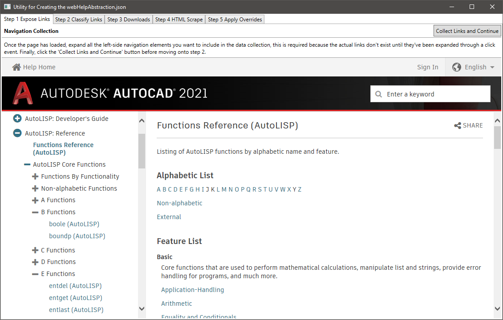
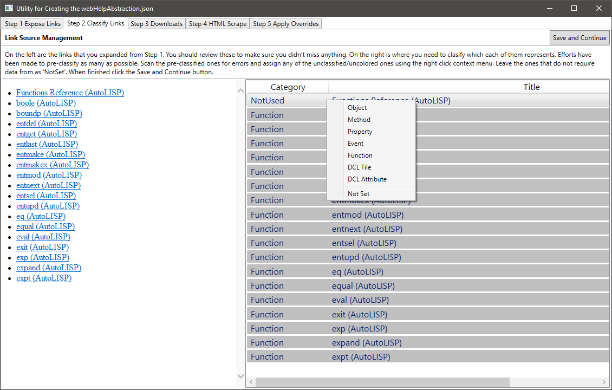
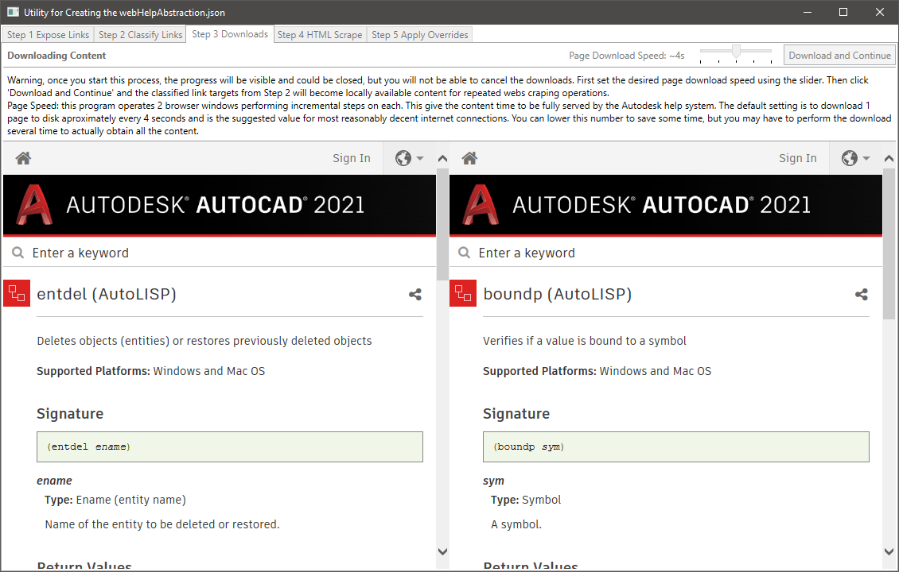
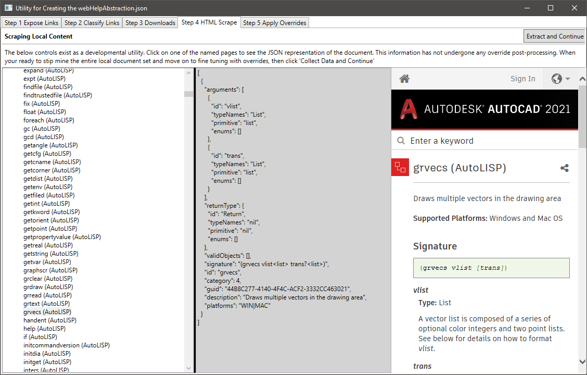
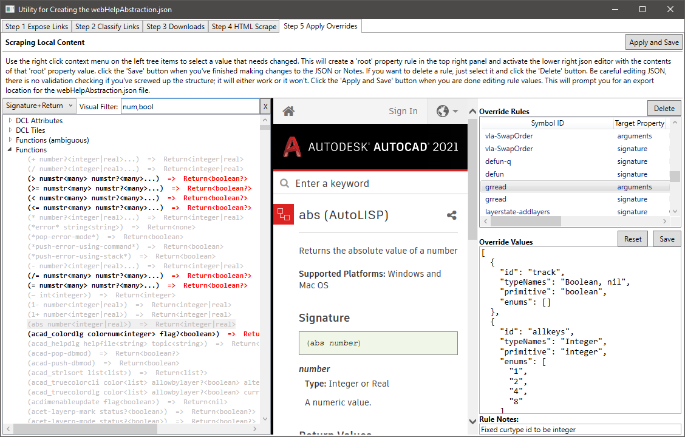

##Creating the webHelpAbstraction.json file

---
#### App Overview
This C# application was created to extract help documentation from the official online resources and create a *.json data file to be used for opening contextual help, inline function information and mouse hover tool tips. All of which is intended to bring the documentation directly into VSCode AutoLispExt.

**Note:** There is an ExtractHere.ZIP file in the ./Processing/ folder that represents the data that was used to generate/export the webHelpAbstraction.json file. Also note that this file is expected to be extracted directly into the folder where the zip resides.

**Dependencies:** This project uses 2 open source NuGet packages (HtmlAgilityPack & Newtonsoft.Json) and you will have to install those yourself or add references to the dll's in the /debug/bin/ folder.

---

#### Step 1 - Extracting Links
On this first page you will need to expand (to expose/generate) all the left panel navigation links you want to extract. Once that is done you'll click the 'Collect Links and Continue' button.

**Note:** This should be capable of processing ActiveX[Objects, Properties, Methods & Events], DCL[Tiles, & Attributes], and all the AutoLisp function pages. ActiveX Events are not directly supported in AutoLisp and were added only to get full coverage the 'ActiveX Reference' documentation GUID pointers.

---
#### Step 2 - Categorize Links
Next you'll need to help categorize the links. Most of them will already be identified and set to the appropriate Category, but any that aren’t colored will be skipped if you don't assign them a category using the right click context menu. The html on the left is just a browser visual of the exact elements it identified as links. Which is probably easier to review for omissions than the colored pane on the right. what was extracted.

---
#### Step 3 - Downloading Content
The goal at this point is to get the data out of the internet and into a local resource we can "work with" and fine tune. The total number of pages downloaded and used to produce the webHelpAbstraction.json was around 2100. That is roughly a 2-3-hour download period. So, you will want to extract our baseline zip in the processing folder to avoid that task. This was necessary because these page targets are just templates and the Autodesk back end pushes the content into them from a database. Kind of similar to how you had to expose the links in Step1 because they literally don't exist until requested. Kind of important to review the text header for this step. When done placing your bets, click the 'Download and Continue' button.

---
#### Step 4 - Extracting Data
At this point we've downloaded a bunch of HTML's, but we haven't actually extracted the data from them. On the left side you can select one of the (now localized) file links. This will navigate the browser on the far right to the official page and present you with the JSON representation that will be extracted. This is a great tool to figure out how these are represented in the webHelpAbstraction.json file. When ready, click the 'Extract and Continue' button

#### Step 5 - Apply Overrides
This is your last opportunity to identify problems with the parse operations and create rules to compensate for them. Fact is, there is a lot of variety in AutoLisp and content generation of this scale doesn't usually have perfect symmetry. Generally, it is fairly good though and why so much is able to be obtained through an extraction process. Ultimately, you will find at least 40 rules in that ExtractHere.ZIP to compensate for edge cases and occasional missing Enum values. These rules show up on the right/top listbox. The textbox/controls below it are where you actually change values. These are in JSON format and there is no validation against your edits; be careful.. Also note, nothing in the Values/Notes fields will save unless you actually click that save button.

The center pane (web browser) regularly updates to the official documentation representing the rule or left-most function/object that was last selected. Use the right click context menu on the left treeview to explore values and click ones you want to make rules for. Yes, a click on anything (except ID & Category) in that context menu will automatically create a rule for the root property of whatever was selected. You'll also notice that a bunch of things are dimmed out. This is because I used 'num' and 'bool' as keywords (comma separated) in the visual filter box. This is a super valuable tool to find erroneous problems that need override rules.

When your all done creating the necessary rules, click the 'Apply and Save' button. You will be prompted with a file save dialog. To use this with the AutoLispExt project, it would be saved using the suggested name into this folder: /extension/src/help/

