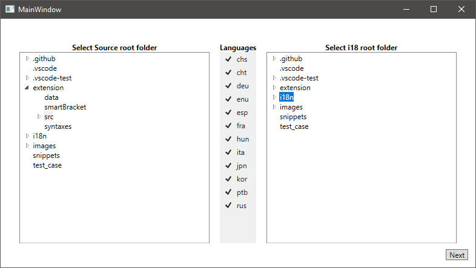
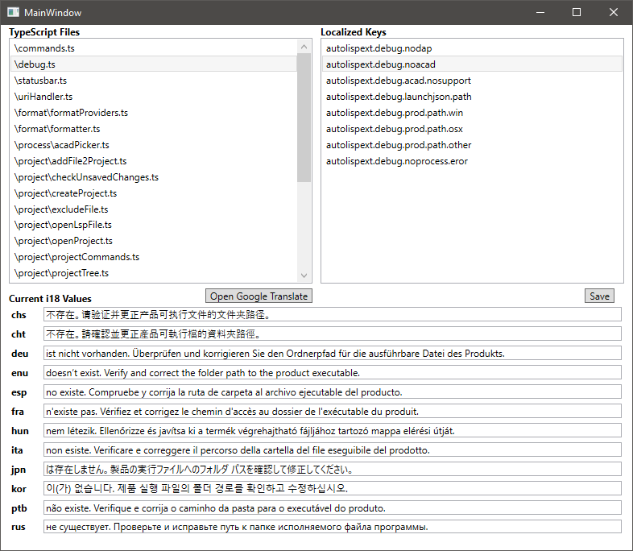

# AutoLispExt i18 Helper
This application was put together to detect and help resolve `AutoLispExt.localize()` TypeScript references. This allows a division of concerns through focusing on code and not missing things that need to be localized later. This also helps normalize all the files structures to a standardized (newtonsoft) representation. More often than not this should really only affect structural spacing.

## Execution
When you first run the application, you will immediately be prompted for a folder. It does this using the SaveFile dialog, any filename is a valid result to extract a directory. This directory is expected to be the root of your local project clone.

## Configuration
Next you will be presented with two required selections and one optional. These are absolutely critical because of the way they loosely mirror each other. 
- Left: The first needs to be the /extension/src/ folder. 
- Right: The second is the /i18n/ folder. 
- Middle: You could remove languages by un-checking them, but I don't know why we would want to. If new languages need to be added, then the XAML will have to be updated.
- When you've made the selections, click the **Next** button.
Note: A number of directories have been excluded from showing up to reduce the TreeView Node generation time, but there will still be some lag before you can make selections.

## i18 Editing
This next screen is divided into 3 distinct areas.
- Top/Left: List of *.TS files containing references to `AutoLispExt.localize()`
- Top/Right: After selecting a *.TS file, this panel will populate with the unique ID's it found in the selected TypeScript file
- Bottom: This presents the current values of each of the languages that were checked on the first screen.
- When you are completely done editing files, click the **Save** button to update the json files. Note that this does not check to see if anythings changed. It is a complete dump of the memory versions that were referenced by the *.TS file back into the /i18n/ folder. This helps normalize the JSON files to a standardized format, but if they didn't actually change, then git will not detect any changes even though the file was actually modified.
- Open Google Translate Button: This was introduced to help fill in the blanks. This feature does have enhanced behavior if the **enu** version was already filled out.

Notes: 
- The original contents of the JSON file is held in memory and all changes made will only affect those memory versions until you click Save.
- Any existing entries that were not located within the *.TS will not be shown, but they are preserved by these memory representations.
- If no existing files were found, then they will be created to represent the missing `AutoLispExt.localize()` entries.

